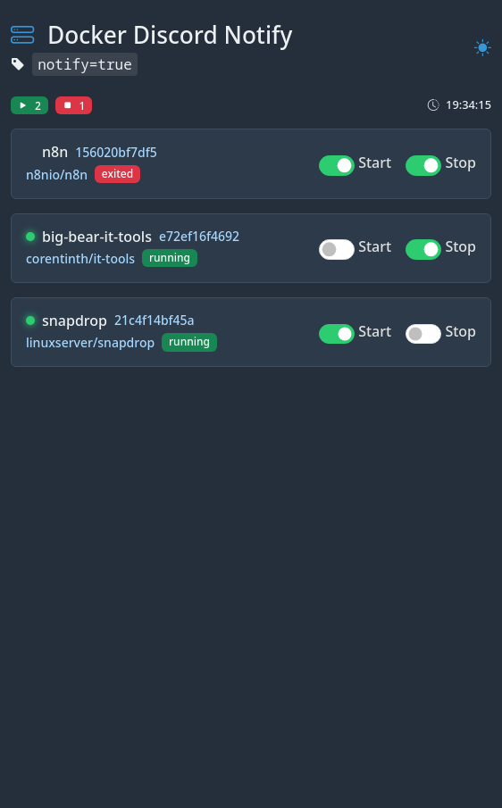
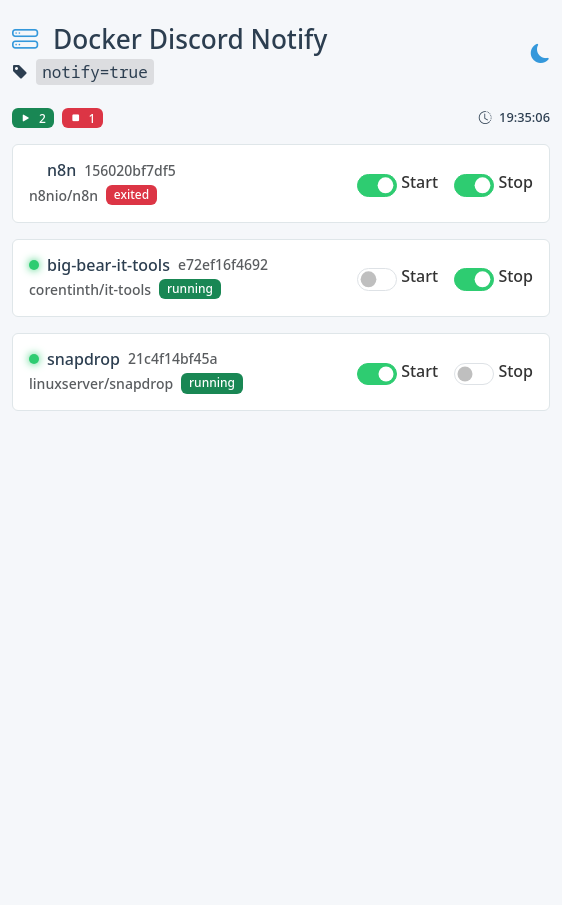

# Docker Discord Notify

This project is a Docker event monitor that sends Discord notifications when containers with a specific label (`notify=true`) are started or stopped. It includes a web interface to manage settings and supports light/dark themes.

## Prerequisites
- Docker installed
- Access to a Discord webhook
- Permissions to access `/var/run/docker.sock` (on the host)

## Scenario 1: Using the GitHub Repository

### Cloning and Setup
1. Clone the repository:
   ```bash
   git clone https://github.com/your-username/docker-discord-notify.git
   cd docker-discord-notify
   ```
2. Edit `docker-compose.yml` to add your `DISCORD_WEBHOOK`:
   ```yaml
   environment:
     DISCORD_WEBHOOK: "https://your-webhook-here"
   ```
3. Start the services:
   ```bash
   docker-compose up --build
   ```
4. Access the interface at `http://localhost:3055`.

### Project Structure
- `Dockerfile`: Defines the base image and installs dependencies.
- `listener.py`: Main logic with Flask and Docker event listener.
- `docker-compose.yml`: Service and volume configuration.
- `requirements.txt`: Python dependencies (e.g., Flask, docker).

### Customization
- Adjust `TRIGGER_LABEL` and `TRIGGER_VALUE` in `docker-compose.yml` to filter containers.
- Use the web interface to enable/disable notifications per container.

### Screenshots
- **Dark Theme**: 
- **Light Theme**: 

## Scenario 2: Direct Installation with Docker CLI

### Steps
1. Pull the image from Docker Hub (replace `your-username` with your username):
   ```bash
   docker pull your-username/docker-discord-notify:latest
   ```
2. Run the container with environment variables:
   ```bash
   docker run -d \
     -p 3055:8080 \
     -v /var/run/docker.sock:/var/run/docker.sock:ro \
     -v notify_data:/data \
     -e DISCORD_WEBHOOK="https://your-webhook-here" \
     -e TRIGGER_LABEL="notify" \
     -e TRIGGER_VALUE="true" \
     your-username/docker-discord-notify:latest
   ```
3. Access the interface at `http://localhost:3055`.

### Notes
- The `notify_data` volume persists configurations in `/data`.
- Port 3055 on the host maps to 8080 in the container.

## Example of Usage
This tool is ideal for monitoring critical containers, such as a Node.js API or a Next.js frontend, to get real-time updates on their lifecycle. To monitor a container, add the label `notify=true` when creating or updating it. Here’s an example:

- **Using `docker run`**:
  ```bash
  docker run -d --name my-api \
    -p 3000:3000 \
    -l notify=true \
    node:18-alpine \
    sh -c "node app.js"
  ```
  This starts a Node.js container named `my-api` with the label, triggering notifications when it starts or stops.

- **Using `docker-compose.yml`**:
  ```yaml
  version: '3'
  services:
    my-next-app:
      image: node:18-alpine
      ports:
        - "3000:3000"
      labels:
        - "notify=true"
      command: sh -c "npm run start"
  ```
  This defines a Next.js app container with the label, ensuring it’s monitored by the notifier.

Adjust the label value or name in the environment variables if you customize `TRIGGER_LABEL` and `TRIGGER_VALUE`.

## Contributing
- Fork the repository.
- Create a branch for your changes.
- Submit a pull request.

## License
MIT